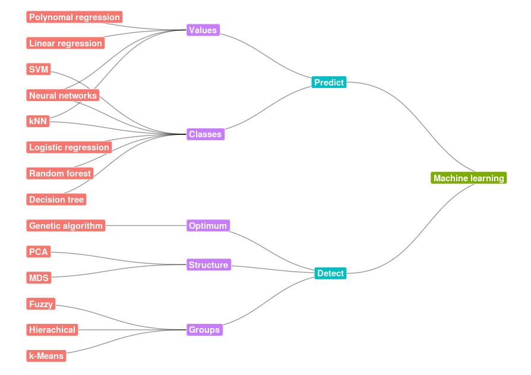

# Libraries
The [**ggraph** library](https://www.rdocumentation.org/packages/ggraph/versions/0.1.1/topics/ggraph) focuses on networks graphs. In these types of graphs information is stored in nodes and links between them. Nodes are sometimes called vertices, while links are sometimes called edges. ggraph, like ggplot2, follows the Grammar of Graphics paradigm. The [**igraph** library](http://igraph.org/r/doc/aaa-igraph-package.html) is used to create the graph data from data frames.
```r
# Loading libraries 
library(ggraph) 
library(igraph)
```

# Basic network

## Preparing your data

ggraph is used to create plots consist of _nodes_ and _links_. Since the number of links probably differ, they should be put in two different tables: a link table and a node table. Each of the tables should also contain the information you plan to use in the node/link. In link tables, the first two columns express the relations between nodes, the first column is the 'from' node, while the second is the 'to' node. When the relation between nodes is directional, the first column is the 'parent', while the second is the 'child'.
```r
# Create data frame with links between nodes
from <- c("D", "E", "F", "B", "C", "G", "H", "I")
to <- c("B", "C", "C", "A", "A", "C", "B", "A")
weight <- c(.5, 0.3, 0.3, 1, 1, .4, .7, .6 )
links <- data.frame(from, to, weight)
```
When creating the 'node' table, take care to put in all the nodes that are in the 'from' or in the 'to' column in the link table.
```r
# Create nodes data frame
name <- c("A", "B", "C", "D", "E", "F", "G", "H", "I")
depth <- c("0", "1", "1", "2", "2", "2", "2", "2", "1")
nodes <- data.frame(name, depth)
```
The link table should be parsed to an 'graph' data type. For example this could be done for data frames with the _data_frame_to_graph()_ function.

```r
graph <- graph_from_data_frame(links, nodes, directed = TRUE)
```
## Drawing the graph

The code below is an example of a networked graph:
```r
# Create Graph
set.seed(42)

ggraph(graph) +
  geom_edge_link(aes(edge_alpha = weight)) +
  geom_node_point(aes(colour = depth),size = 6, alpha = 0.4) +
  geom_node_text(aes(label = name, colour = depth), repel = TRUE, size = 10) +
  scale_color_brewer(palette="Set1") +
  theme_void()
```
Before we draw the graph the random seed is set, the ggraph function uses to put the nodes on the grid. The _geom_edge_link_ 

This results in the graph.


# Tree/Hierarchical network

## Preparing data

For this example I've created two downloadable CSV files, one for the [nodes](/_pages/tutorials/network-graphs-with-ggraph/ggraph-hierarchical-vertices.csv) and one for the [connections](/_pages/tutorials/network-graphs-with-ggraph/ggraph-hierarchical-edges.csv). I used this code for my presentation [Machine Learning for the Layman](/machine-learning-layman/). We load these CSV's first.
```r
tbl_vertices <- read.csv("ggraph-hierarchical-vertices.csv", na.string = "NA")
tbl_edges <- read.csv("ggraph-hierarchical-edges.csv", na.string = "NA")
```
As with the previous example, data from a data frames needs to be put in a 'graph' data type. 
```r
graph <- graph_from_data_frame(tbl_edges, tbl_vertices, directed = TRUE)
```

## Drawing the graph

Again we draw the graph, but there are some differences

```r
ggraph(graph, 'igraph', algorithm = 'tree') + 
  geom_edge_diagonal(edge_width = 0.5, alpha =.4) +
  geom_node_label(aes(label=node, fill= type), col = "white", fontface = "bold", hjust = "inward") +
  scale_color_brewer(palette="Set2") +
  guides(fill = FALSE) +
  theme_void() +
  coord_flip()
```


This resulting graph:
{:refdef: style="text-align: center;"}
<a href="cheshire-cat-cloud.png" target="_blank">

<br>
<i class='fa fa-search-plus '></i> Zoom</a>
{: refdef}

