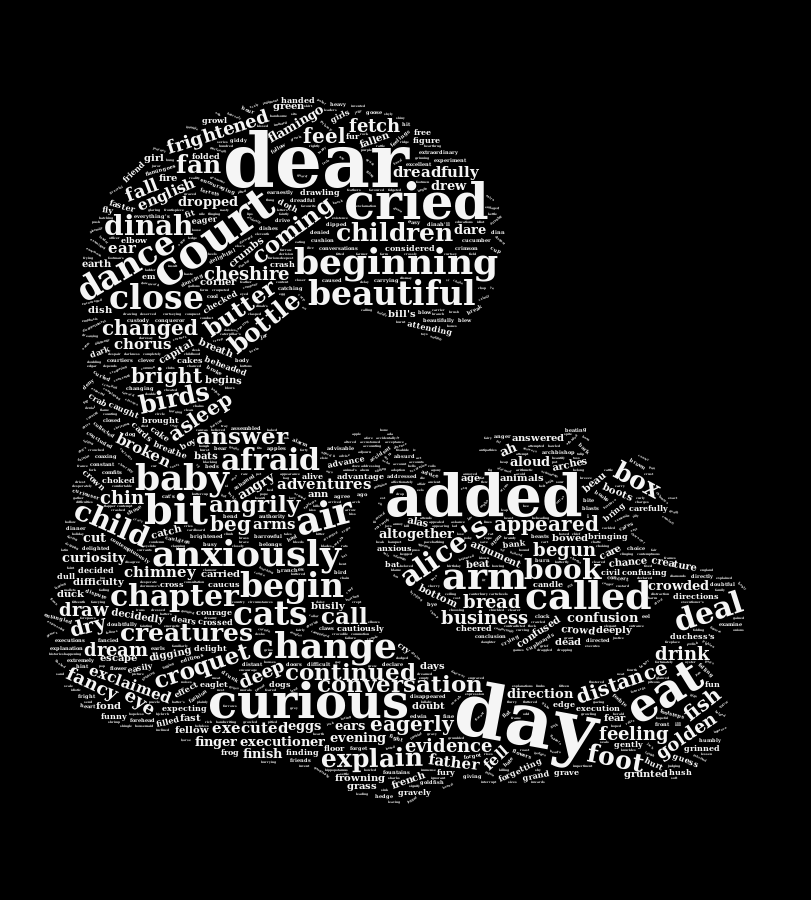

# Font matter

```
---
layout: page
title: Duuuuh....
permalink: /relative-url/
comments: true
---
```

# Images:

* Right image:
```

```
* Centered image
```
{:refdef: style="text-align: center;"}

{: refdef}
```

* Centered image with zoom:
```
{:refdef: style="text-align: center;"}
<a href="cheshire-cat-cloud.png" target="_blank">
<br>
<i class='fa fa-search-plus '></i> Zoom</a>
{: refdef}
```

Code:
```
```r
plutchik_wheel <- function(radius)
```
```

# Links:

* General: ```[wonder off...](https://www.youtube.com/watch?v=9Bk9ao6cSFs)```
* Library links: ```**[tidytext](https://cran.r-project.org/web/packages/tidytext/vignettes/tidytext.html)**```
* Script download:  ```[here](https://gist.github.com/mark-me/d080979ce8beb595faf1dcab38b6e392)```


