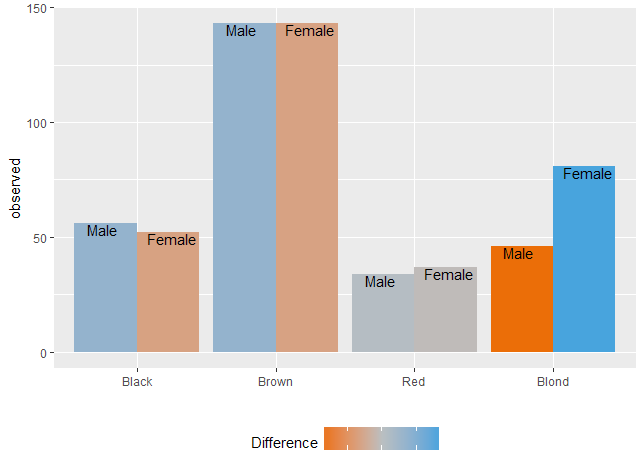

## Descriptive

### Proportion

There are many ways to do this but, for no particular reason, I've chosen to do this with the **dplyr** framework:
```r
iris %>% 
  group_by(Species) %>% 
  summarise (n = n()) %>%
  mutate(proportion = n / sum(n))
```
This shows the proportion of each species of iris (33% for each):
```
# A tibble: 3 x 3
     Species     n proportion
      <fctr> <int>      <dbl>
1     setosa    50  0.3333333
2 versicolor    50  0.3333333
3  virginica    50  0.3333333
```

### Mode

There is no standard function to calculate the mode that I know of (if you know one, please leave a comment), so I created called _calc_mode_:
```r
calc_mode <- function(x){ 
  table_freq = table(x)
  max_freq = max(table_freq)
  if (all(table_freq == max_freq))
    mod = NA
  else
    if(is.numeric(x))
      mod = as.numeric(names(table_freq)[table_freq == max_freq])
  else
    mod = names(table_freq)[table_freq == max_freq]
  return(mod)
}
```
In the case where there is one value with the highest frequency that value will be returned:
```r
> table(diamonds$cut)
     Fair      Good Very Good   Premium     Ideal 
     1610      4906     12082     13791     21551 

> calc_mode(diamonds$cut)
[1] "Ideal"
```
In case all values have the same frequency _NA_ will be reported as the mode
```r
> table(iris$Species)
    setosa versicolor  virginica 
        50         50         50 

> calc_mode(iris$Species)
[1] NA
```
When there are multiple values with the same frequency, all those will be returned
```r
> table(mtcars$mpg)
10.4 13.3 14.3 14.7   15 15.2 15.5 15.8 16.4 17.3 17.8 18.1 18.7 19.2 19.7   21 21.4 21.5 22.8 24.4   26 27.3 30.4 32.4 33.9 
   2    1    1    1    1    2    1    1    1    1    1    1    1    2    1    2    2    1    2    1    1    1    2    1    1 

> calc_mode(mtcars$mpg)
[1] 10.4 15.2 19.2 21.0 21.4 22.8 30.4
```

## One sample

### Chi-Square Goodness of Fit test


With the [Chi-Square Goodness of Fit Test](http://www.stat.yale.edu/Courses/1997-98/101/chigf.htm) you test whether your data fits an hypothetical distribution you'd expect. Let's take the example of dice. First you have a data set you've collected by throwing a dice 100 times, recording the number of times each is up, from 1 to 6:
```r
throws <- c(18, 16, 15, 17, 16, 18)
```
Then we fill a vector which expected probabilities of each side being thrown:
```r
exp_throws <- c(rep(1/6, 6))
```
Then the function _[chisq.test](https://stat.ethz.ch/R-manual/R-devel/library/stats/html/chisq.test.html)_ to test whether this dice isn't tampered with, or needs to be replaced:
```r
chisq.test(throws, p = exp_throws)
```
Resulting in:
```
Chi-squared test for given probabilities

data:  throws
X-squared = 0.44, df = 5, p-value = 0.9942
```
Where the p-value of .9942 tells us we can trust this dice when we want to play a fair game. If you store the result in a variable, you can access the p.value property; this might come in handy if you want to use the result of the test later on in your script.

### Binominal test


With the [binominal test](https://en.wikipedia.org/wiki/Binomial_test) you test whether one value is higher or lower in occurence than expected.

The binominal test is used when there is only two outcomes: succes or failure. While this doesn't mean the variable can only have two values, but only one of the values could be considered succes. If a few values are considered a succes, I would recommend creating a new variable in which you recode the values into a logical values of successes and failures.

The test in R is done by using the function _[binom.test](https://stat.ethz.ch/R-manual/R-devel/library/stats/html/binom.test.html)_. Suppose we think about 75% of our customers are male (the things we think about...), we have no data on it, so we start collecting it by randomly calling 100 of them and registring their gender. We find that 70 of the customers were male. Do we now reject our initial hypothesis of 75%? Let's find piece of mind, and answer this pressing question:
```r
binom.test(70, 100, p = .75, alternative = "two.sided")
```
The output:
```
data:  70 and 100
number of successes = 70, number of trials = 100, p-value = 0.2491
alternative hypothesis: true probability of success is not equal to 0.75
95 percent confidence interval:
 0.6001853 0.7875936
sample estimates:
probability of success 
                   0.7 
```
The miserable p-value of .2491 tells us we can hold on to our hypothesis than 75% of our customers are male. Like with the Chi-squared test, you can access the p.value property if you store the _binom.test_ function's result in a variable.

## Two unrelated samples

### Two sample Chi-Square test


The two sample Chi-square test can be used to compare two groups for categorical variables. A typical marketing application would be A-B testing. But because I want to give an example, I'll take a R dataset about hair color. I'm very, very interested if the sexes differ in hair color. For this I use the **[HairEyeColor](https://stat.ethz.ch/R-manual/R-devel/library/datasets/html/HairEyeColor.html)** data-set; since it's not specified whether the reported haircolor is dyed or natural, I'll assume it's natural. I must prepare it so the frequencies of the sexes are in two columns. Then the data frame is converted to a matrix and the _Hair_ color column is removed and used to name the rows instead. This is done so the _chisq.test_ function is able to process it.
```r
tbl_hair_sex <- as.data.frame(HairEyeColor) %>% 
  group_by(Hair, Sex) %>% 
  summarise(qty = sum(Freq)) %>% 
  ungroup() %>% 
  spread(key = Sex, value = qty)

mat_hair_sex <- as.matrix(tbl_hair_sex[-1])
rownames(mat_hair_sex) <- levels(tbl_hair_sex$Hair)
```
Then the function is applied:
```
chisq.test(mat_hair_sex)
```
The output:
```
	Pearson's Chi-squared test

data:  mat_hair_sex
X-squared = 7.9942, df = 3, p-value = 0.04613
```
The p value is below 0.05 and tells us that there is a difference in hair color between men and women in the sample. When you look at the data, you would see that this is mostly caused by the the female students have proportionally blonder hair.

### Visualizing the results

Since I'm a very visually oriented person I'd like to see the results of the test represented in a graph. Sadly, the regular _chisq.test_ returns it's data in a way that is hard to turn into something we can use with **ggplot2**. To overcome this problem I created a wrapper function around the _chisq.test_ function: _chisq_test_:
```r
chisq_test <- function(x, ...) {
  res_chisq <- chisq.test(x)
  groups <- length(dimnames(as.table(res_chisq$observed)))
  dataset <- as.data.frame(as.table(res_chisq$observed))
  names(dataset)[groups + 1] <- "observed"
  
  dataset <- cbind(dataset, 
                   expected  = as.data.frame(as.table(res_chisq$expected))[[groups + 1]],
                   residuals = as.data.frame(as.table(res_chisq$residuals))[[groups + 1]],
                   stdres    = as.data.frame(as.table(res_chisq$stdres))[[groups + 1]] )
  
  result <- list(statistic = res_chisq$statistic,
                 parameter = res_chisq$parameter,
                 p.value = res_chisq$p.value,
                 method = res_chisq$method,
                 data.name = res_chisq$data.name,
                 dataset = dataset)
  attr(result, "class") <- attr(res_chisq, "class")
  
  return(result)
}
```
I won't go into detail how the function works, but the end result is the a variable similar to the one returned to the _chisq.test_, but all the data elements like observed values, expected values, residuals and standardized residuals are in one data-frame, ready for use in a ggplot. First we'll apply the function, and store it's result:
```r
res_chisq <- chisq_test(mat_hair_sex)
```
To visualize this result I've used this _ggplot_ call:
```r
ggplot(res_chisq$dataset, aes(x = Var1, y = observed, group = Var2)) +
  geom_col(aes(fill = Var2, alpha = abs(residuals)), position = "dodge") +
  geom_text(aes(label = observed), position = position_dodge(width = 1), vjust = 1) +
  labs(x = "", y = "",fill = "") +
  guides(alpha = FALSE)
```
{:refdef: style="text-align: center;"}

{: refdef}

## Two related samples

### McNemar’s test


**[McNemar's test](https://en.wikipedia.org/wiki/McNemar%27s_test)** is used to see whether observations differ in values on two sets of variables. It's useful for comparing results of questionaires for the same person across a period of time.

In his classic book _[The Decline of Good Taste](https://www.gutenberg.org/ebooks/search/?query=The+decline+of+good+taste)_ Dr. Edward McAuliffe lamented the ascent of the frivolous bow-tie to the expense of the refined [cravat](https://mccannbespoke.co.uk/how-to-wear-a-cravat/). Being the reputed scientist he was, he didn't go by feeling but relentlessly carried out two questionnaires to the same 2.000 men with 2 years in between. The men were asked if they wouldd rather wear a bow-tie or a cravat. Here I recreate the results:
```r
tbl_cravat <- data.frame(first_result = c(rep("Cravat", 1500), 
                                          rep("Bow-tie", 500)), 
                         second_result = c(rep("Cravat", 1300), 
			                   rep("Bow-tie", 700)))

tbl_data %<>%
  group_by(first_result, second_result) %>% 
  summarise(qty = n()) %>% 
  ungroup() %>%
  spread(key = second_result, value = qty) %>% 
  select(Approve, Disapprove)
```
To test whether their opinions changed we can apply the data frame to the _[mcnemar.test](https://stat.ethz.ch/R-manual/R-devel/library/stats/html/mcnemar.test.html)_ function.
```r
mcnemar.test(as.matrix(tbl_data))
```
Output:
```
	McNemar's Chi-squared test with continuity correction

data:  as.matrix(tbl_data)
McNemar's chi-squared = 66.002, df = 1, p-value = 4.505e-16
```
Seeing the p value is so low, we can assume the general sentiment toward the cravat changed. And seeing the direction of the fashion evolution we will mourn together with Dr. McAuliffe about this great loss in gentlemanly traditions...

## Association between 2 variables

### Contigency coefficients or Cramer's V


Several measures can be used to estimate the extent of the relationship between two variables, or to show the strength of a relationship:

* Phi Coefficient - This can only be calculated on 2-by-2 tables.
* Contingency coefficient - The contingency coefficient is [critiqued](https://accendoreliability.com/contingency-coefficient/) for not reaching it's outer limits of -1 and +1.
* [Cramer's V](https://en.wikipedia.org/wiki/Cram%C3%A9r%27s_V) - This measure has none of the drawbacks of the Phi and Contingency coefficcents. The values come between 0 and 1. All three can be calculated by using the _assocstats_ function from the **vcd** library.

We'll use the **[HairEyeColor](https://stat.ethz.ch/R-manual/R-devel/library/datasets/html/HairEyeColor.html)**, we've used for the Chi-square test. Again: I assume the data-set reports natural hair color like Steven Seagal does. 
```r
library(vcd)
assocstats(mat_hair_sex)
```
Output:
```
                    X^2 df P(> X^2)
Likelihood Ratio 8.0928  3 0.044131
Pearson          7.9942  3 0.046131

Phi-Coefficient   : NA 
Contingency Coeff.: 0.115 
Cramer's V        : 0.116 
```
The association seems to be weak.
